# Train your AI Birds, a macOS educational game.


Update: 本作品是[Apple WWDC24 Swift Student Challenge](https://developer.apple.com/cn/swift-student-challenge/?cid=ssc-ht) 获奖作品

[GitHub Link](https://github.com/EthanNCai/WWDC24_Train_Your_AI_Birds) 提示：GitHub的代码编译完是英文版的，这篇文章的软件是翻译成中文版界面之后的。


## 简介

这是一款为macOS打造的用于进行机器学习启蒙的教育类体验软件。旨在通过最短的时间（三分钟之内）让用户在一个预设的实验环境里学习、交互、实验机器学习算法中的最简单直观一种，也就是遗传算法，从而起到对该领域启蒙的作用。

值得注意的是，这个软件的体验过程不要求用户提前具备任何关于机器学习的知识，只需保持好奇和细心即可。下图为软件的实验界面，同时支持英文和中文，用户可以选择自己的语言进行体验。

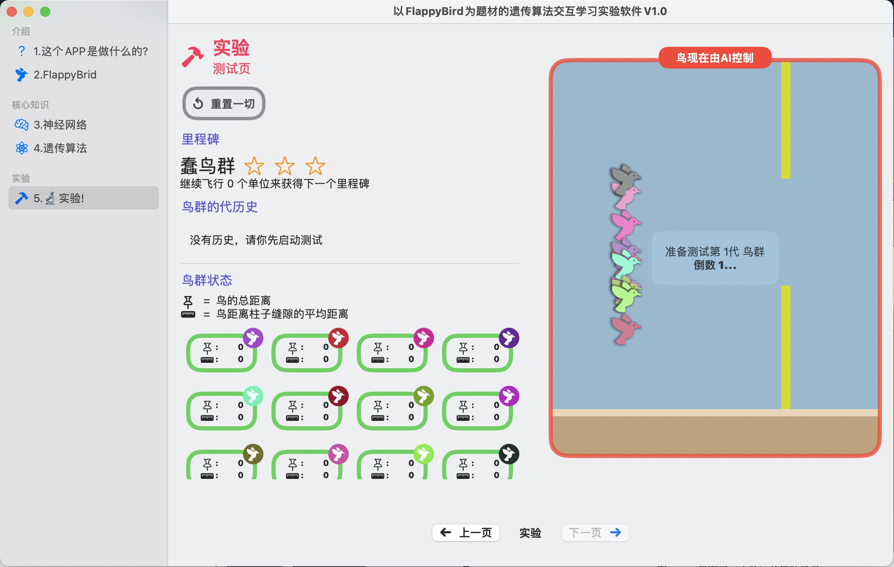

> 图 1.1 软件的实验界面示例


### 开发目的

AI，或者说人工智能，是当今随处可见词汇。即使在日常闲聊中，普通人也会提及人工智能和机器学习。尽管这个词汇及其背后的概念已经广为传播，但对于想要深入了解和理解机器学习的知识的人来说，找到合适的启蒙或者入门方式却仍然存在一定的困难。这是因为学习机器学习的许多细节需要依赖一些先前的知识，并且机器学习本身也是一个相对抽象的概念。因此，传统的多媒体形式（如文章、视频、图片）往往难以直观地让对机器学习稍感兴趣的普通人理解和学习。

为了解决这个问题，我开发了一款体验类的软件，也可以称之为游戏，通过交互的方式让用户直观地理解机器学习中最简单的一个分支，即遗传算法。

我希望这款软件能够为那些对机器学习感兴趣的普通人提供一个更加友好和易于理解的学习平台。通过互动和实践，用户可以更好领悟到机器学习的灵魂所在，并为其可能的进一步学习提供了一个有趣的开端。

### 开发平台介绍

#### 软件

* 集成开发环境：Xcode 15.3
* Swift版本： 5.10
* 操作系统：macOS 14.3.1 (23D60)

#### 硬件

* 型号： MacBook Pro, 13-inch, M1, 2020
* CPU： Apple M1
* 内存： 8GB

#### 使用的框架

* 用户界面: SwiftUI
* 游戏： SpriteKit

#### 系统要求

* 操作系统：macOS 14.3.1
* 存储空间： 5MB

## 界面和使用方法

在这一个部分，我们将会以用户的视角介绍整个软件的使用过程和步骤。
总的来说，整个软件的体验过程如下：

* 介绍试玩FlappyBird
* 学习神经网络
* 学习遗传算法
* 做实验

值得一提的是，本软件的不同使用场景是以页为单位承载的，其有些类似于Microsoft PowerPoint的演绎方式，通过图2.2所示的一些按钮，我们可以在页之间切换，本软件的重点在于最后一页的实验。前面的所有内容均是为用户顺利理解最后的实验做准备。

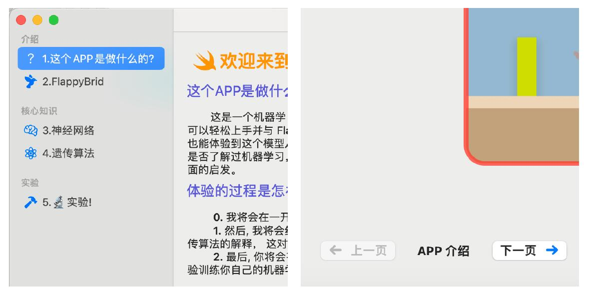

> 图 2.1 切换页的方式 左：左边导航栏 右：底部页切换按键

### 界面一：前言

#### 内容

如图2.2，这是用户使用软件将会看到的第一个界面。在这里通过两段文字分别介绍了这个软件的功能以及这个软件的体验流程。并展示了一张遗传算法的概念图。

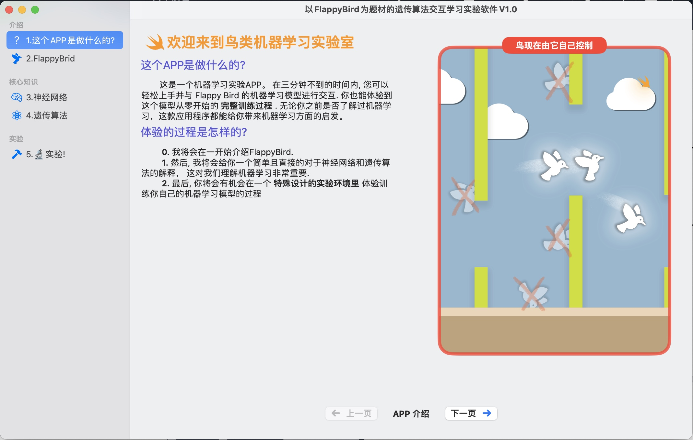

> 图 2.2 界面一：前言

#### 操作

在这个界面没有需要操作的对象，用户在阅读简介完毕之后点击下一步即可进入下一环节（下一页）


### 界面二:试玩FlappyBird

#### 内容

如下面的图2.3，在这个界面，软件将向用户介绍FlappyBird，这是一款知名的小游戏。这是本软件的实验对象，本软件的目标是引导用户体验训练一个能自己玩FlappyBird的AI agent，虽然这个游戏很知名，但我们不能假定用户一定知道这是什么，所以本页的目的就在于让用户通过试玩快速的了解这款游戏的玩法，玩法同样见图 2.3 上的内容。本页体验时间不宜超过三十秒

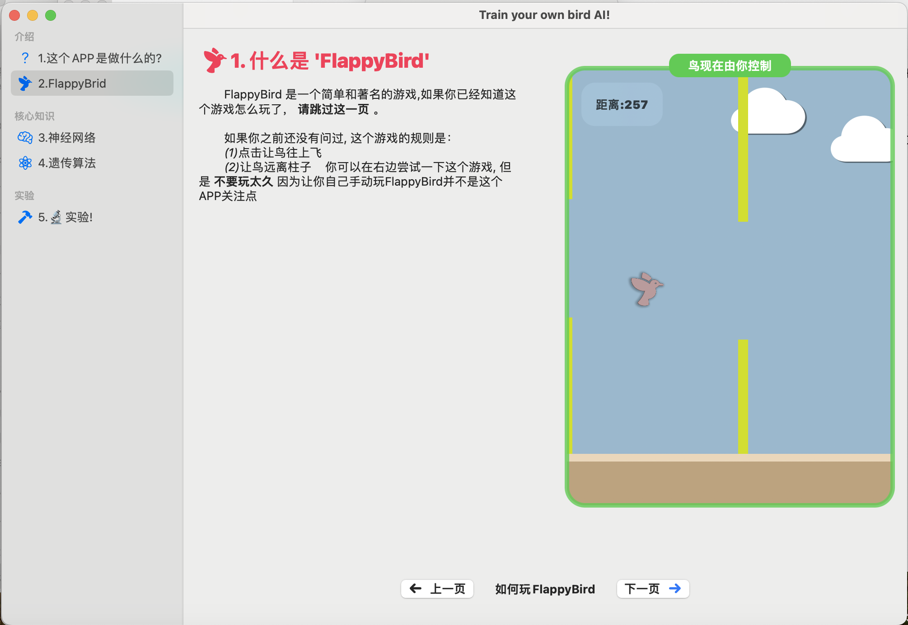

> 图 2.3 界面二 (介绍 FlappyBird) 整体界面：左侧是文字介绍，右侧则是实际试玩区域。用
户可以在实际试玩之后理解 FlappyBird 的玩法并进入下一页


左侧的文字对用户进行了提示，而右边则允许用户实际体验这款游戏。这一章所展示的是最简单的FlappyBird游戏，它只有三个阶段，展示于下方，即图2.4。

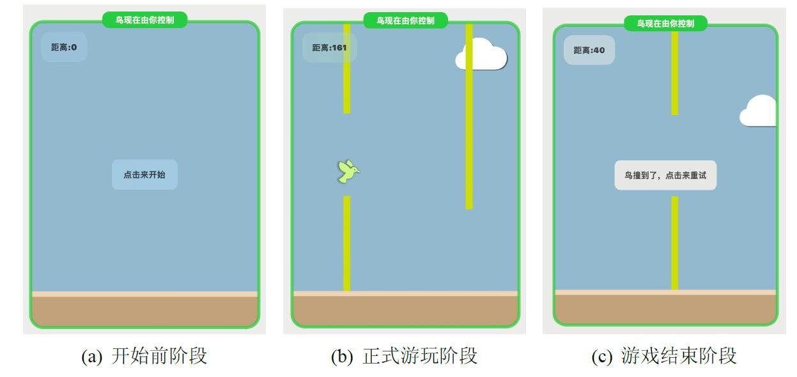

> 界面二 (介绍 FlappyBird) 整体界面：左侧是文字介绍，右侧则是实际试玩区域。用
户可以在实际试玩之后理解 FlappyBird 的玩法并进入下一页

游戏界面中，草绿色的是柱子，蓝色背景为天空，背景上的云朵为装饰作用，褐色部分为地面，鸟图案为玩家操控的鸟。

#### 操作

用户点击右边 __“点击来开始”__ 之后即可开始控制。通过控制鸟的向上飞行，并且尽量不要撞到柱子，玩家就可以实际的感受到这个游戏的玩法。在不小心撞墙之后，点击屏幕任意位置就可以重新开始新的一轮。在体验完毕之后点击下一页从而进入下一个环节

### 界面三：学习神经网络

#### 内容


如下方图2.5，在这一部分，右侧仍然是游戏区域，只不过这一次鸟不由用户操控，取而代之的是一个神经网络在操控。


> 图2.5 界面三（学习神经网络）整体界面：这个界面中，左侧是文字以及对神经网络的介
绍以及一个交互式的 UI 模块，右侧是和左侧交互式 UI 绑定的游戏场景。用户可以在这个
界面用最直观的方式理解神经网络的最重要的抽象概念，即其是一个“黑箱子


这一部分的主要目的也是向用户用最直观的方式表现神经网络的“黑盒”概念。在这个部分中，我们将使用一个如图 2.6的一个和游戏界面链接的面板，展示本软件所建立的用于支持鸟自动飞行的鸟背后的神经网络的抽象结构。

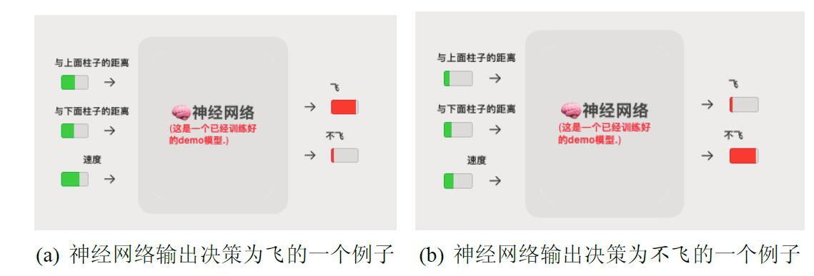

> 图 2.6 界面三 (学习神经网络) 中的动态交互面板：和右侧的游戏界面中的环境数据保持同步，直观的展示了与上面柱子的距离和与下面柱子距离的距离是速度作为输入和飞或者不飞作为输出的量化指示。以及二者之间的黑盒（神经网络）的位置

这里，本文提供了两个例子，其一，神经网络给出了 _飞_ 的决策（图2.6左），另一个则给出了 _不飞_ 的决策（图2.6右）。


用户在阅读文字的时候可以点击“点击来展示”从而开始启动游戏以及和其链接的神经网络监视面板。

软件向用户对神经网络的解释可以于图2.5中的文字阅读，这里本文便不再赘述。

#### 操作

用户点击右边的 __点击来展示__ 以开始观看一个已经训练的神经网络是如何工作的。在阅读文字以及体验之后，点击下一页以进入下一个环节

### 界面四：学习遗传算法

#### 内容

如图\ref{fig:ga}，这个界面向用户描述了遗传算法的大致内容，详细的原理细节将会在后续章节展示，本章本文仅限介绍使用方法。

软件向用户对遗传算法的解释可以于图\ref{fig:ga}中的文字阅读，再次本文不再赘述。

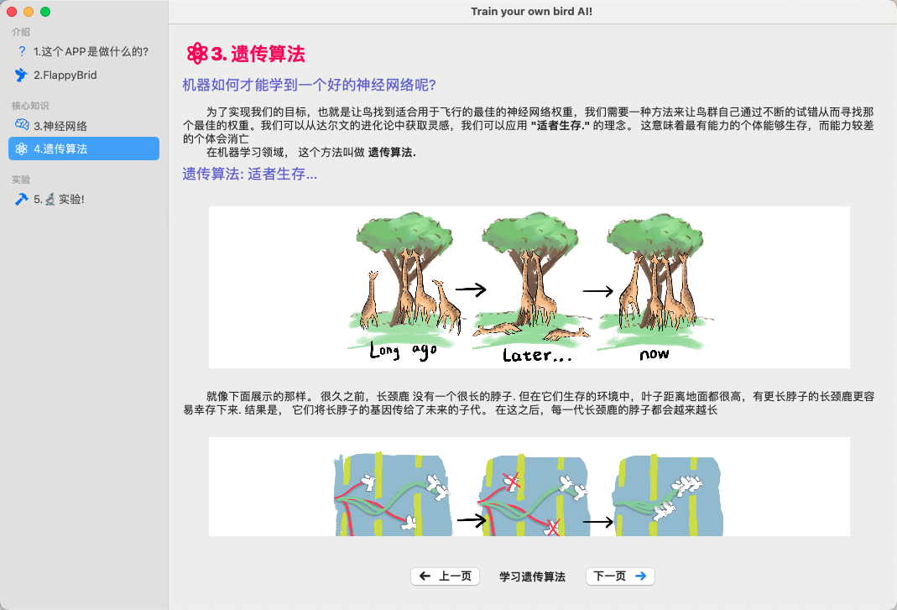

> (a) 遗传算法介绍界面上

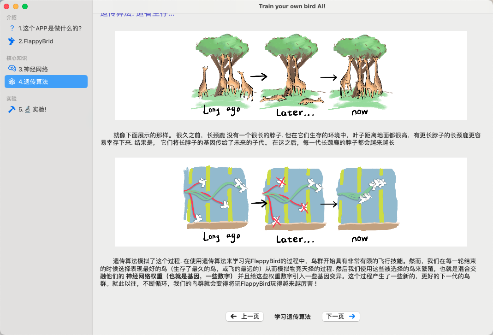

> (b) 遗传算法介绍界面下

> 图2.7 界面四 (学习遗传算法) 界面总览：这个界面用文字和图片的形式描述了遗传算法的精髓，由于篇幅限制，本文分为两张示意图展示了软件内所有的文字信息


#### 操作

这一个场景没有可以需要操作的部分，用户在阅读完毕之后点击下一页来进入下一个环节

### 界面五：实验

#### 内容

本页面是整个软件的最重要的页面，在这个页面，用户将亲手通过遗传算法训练一个随机初始化的神经网络，并最终使其适应自动玩FlappyBird。在初入该页面将会看到实验提示如图 2.8。关闭后则是实验主界面，这个界面比较复杂，本章接下来的篇幅首先会对这个界面的各个部分进行介绍，随后对使用流程进行介绍。


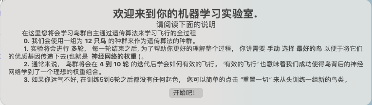

> 图 2.8 界面五（实验）的实验前提示框：本软件在实验之前为用户提供了一些注意事项，它们能更好的帮助用户理解本软件设置的实验的意图和流程

实验界面大致可以分为两个场景，一个是实验模拟场景，一个是每局结束后的繁殖场景


实验模拟场景如下面的图2.9，这个场景分为两个部分，也就是左边的信息面板部分，右边的游戏界面。


> 图2.9 界面五（实验）的实验模拟场景

对于信息面板部分，从上到下分别是 _里程碑、鸟群的代历史、鸟群状态_ 三个模块

* __里程碑__ : 这里记录了用户训练的鸟群神经网络的总体表现的里程碑，分为三个等级：_“蠢鸟群”，“新手鸟群”，“有能力的鸟群”，“大师鸟群”_ 。 除了显示里程碑标题，这里还会在模拟开始后显示距离下一个里程碑的进度。
* __鸟群代历史__ ：在这里会显示每一代鸟群（12只鸟）的平均飞行距离，这能间接反映鸟群学习飞行的水平。有进步为绿圈，退步为红圈
* __鸟群状态__ ：在模拟开始之后显示每一只鸟的状态，分别显示每一只鸟的飞行距离、平均距离柱间隙的高度差 、生存状况（当鸟撞到柱子或者地面时将会被淘汰，外圈会由绿色变为红色，然后停止更新其他指标）  

对于繁殖场景，如图 2.10，这里将会结算显示12只鸟在这一轮模拟中的表现，共有两个指标显示。用户会被要求选择2到5只他们认为最优秀的鸟，然后点击下面的按钮。

#### 操作

进入实验界面，阅读实验注意事项时候，点击右侧游戏界面的“点击来开始”开始第一轮实验。在这一轮，鸟群的表现可能很糟糕，这是因为这一轮所有鸟的支持其决策的神经网络的参数都是随机初始化的。

当每轮中的所有鸟都被淘汰之后，系统将会结算这一轮中每只鸟的表现，并量化成两个指标供用户参考。然后用户需要在繁殖界面（图 2.10）通过点击的形式选择自己认为的最好的2-5只鸟。点击繁殖之后就会进入下一轮模拟。用户可以通过左边信息面板的一些信息，或者直观的观察游戏模拟界面来感受到一代一代的鸟变的越来越聪明（当然用户也可以故意将鸟训练的越来越笨）。

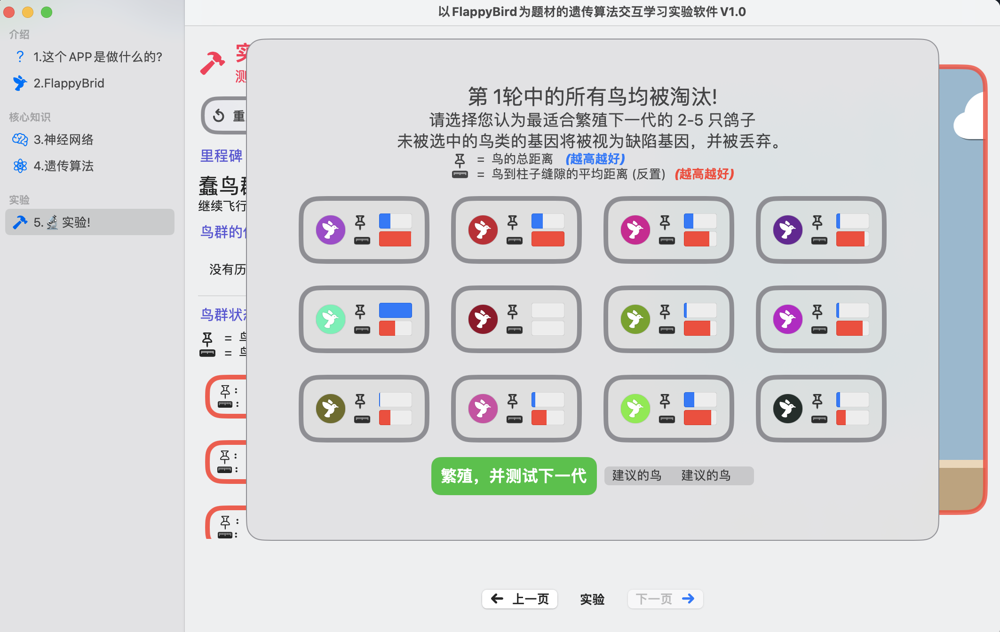

> 图 2.10 界面五（实验）的繁殖场景


## 基本原理介绍

在这个部分，本文将会简要介绍本软件的编程实现方面的总体情况，仅对关键部分内容进行展开说明（附部分代码）

### 软件框架

本软件采用MVVM架构模式开发，即 Model-View-ViewModel（模型-视图-视图模型）。也就是将用户界面与业务逻辑分离。在 MVVM 架构中，模型（Model）代表应用程序的数据和业务逻辑。视图和视图模型之间建立了双向数据绑定关系，当视图模型的数据发生变化时，视图会自动更新；当视图的用户交互行为发生变化时，视图模型会接收到相应的命令或事件，并执行相应的业务逻辑。

本软件大部分试图涉及游戏场景，游戏场景不同于一般的视图场景，需要一些特殊的处理。本软件微调了标准的MVVM架构以适应视图中存在的特殊的游戏场景的内容更新。如图 3.1所示，本软件的代码总体由视图部分和逻辑部分组成，视图可分为SwiftUI框架编写的普通视图以及SpriteKit编写的特殊游戏场景视图。其中GameScene是为特殊的游戏场景视图单独设立的逻辑控制器。其声明时需要将主控制器的引用作为类属性传入，从而在单个游戏场景的生命周期访问主控制器的一些内容。

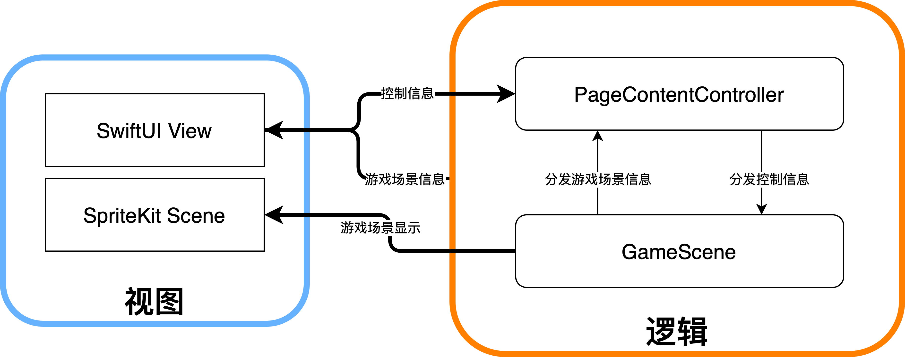

> 图 3.1 软件的架构图：由于游戏场景的特殊性（固定帧刷新等特性），本软件使用单独GameScene 对游戏场景的逻辑进行管理，并在必要时与主逻辑控制器（也就是 PageContentController）通讯。其中，PageContentController 是在 GameScene 类声时作为其类的属性以引用的形式传入的


### FlappyBird 循环游戏系统


前文提到过，本软件的目标是引导用户完成对一个自动玩FlappyBird游戏的AI的构建实验。
本部分本文将介绍本软件对FlappyBird基础游戏系统的构建原理和思路。游戏的状态转化图见图 3.2，总共有三个主要状态，这三个状态对应着先前章节的图 2.4的三个状态。

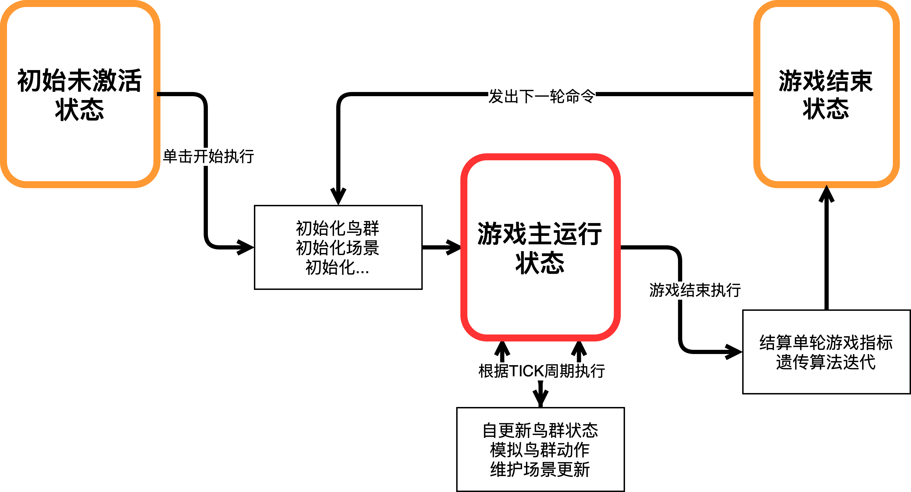

> 图 3.2 FlappyBird 循环游戏系统概览图：其中游戏主运行状态中的按 Tick 执行的代码块是
游戏逻辑的主要执行区域，游戏运行结束的代码块是遗传算法迭代逻辑所在的区域

仅当游戏处于游戏主运行状态时，游戏需要根据一组提前设定好的Tick周期的执行一些操作。有些操作需要较快的刷新速度（较小的tick）例如鸟类的内部状态计算或者对于每只鸟的神经网络的实时推理，这些操作往往需要0.05秒左右的短周期来确保告诉更新。有些操作则不然，例如柱子和云朵的生成，间隔为1.5秒左右。

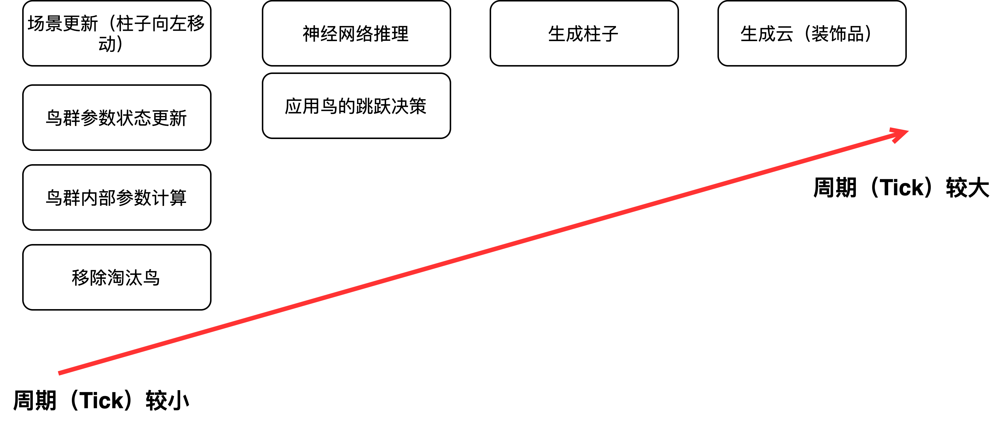

> 图 3.3 游戏循环进行时根据不同 tick 需要周期执行的一些逻辑

### 神经网络代码实现细节

在实验阶段，每一只鸟在每一个Tick的行动决策（在这一Tick是飞还是不飞）都由一个简单的MLP神经网络（见图 3.4）所实时计算决定。

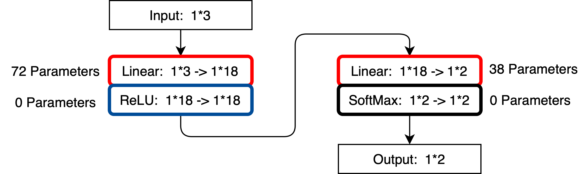

> 图 3.4 支持每一只鸟实时决策的骨干神经网络结构：一个简单的 MLP


输入一个1*3大小的向量，输出一个1*2大小的向量。 
输入的向量由下面三个数值归一化后组合而成：


*  鸟距离上柱子下边缘的距离
*  鸟距离下柱子上边缘的距离
*  鸟垂直方向速度


输出的向量的意义是

*  在这个Tick决定要飞的概率
*  在这个Tick决定不飞的概率


根据图 3.4展示的神经网络结构。整个网络仅有110个参数，这是为了在多只鸟并行模拟时能占用更少的计算资源。由于Swift语言并未提供一个适合此项目的机器学习框架，并且本项目需要的神经网络较为简单。本项目使用Swift中基本的Float数组来进行网络正向传播搭建，代码的编写风格为类Pytorch风格，下面展示了主forward函数

```swift
func forward(input: [Float]) -> [Float]{
    
        let x1 = self.feed_forward1(input_tensor: input)
        let x2 = self.ReLU(input_tensor: x1)
        let x3 = self.feed_forward2(hidden_tensor: x2)
        let x4 = self.softmax(input_tensor: x3)
        return x4
}
```

对每一个参数随机初始化时，我们选择对weights参数控制范围 -5 到 5，对bias参数控制范围 0 到 0.1，经过实践检验这样的初始化效果最佳。初始化代码如下：

```swift
// ramdom initialize weights and bias
    self.weights_layer1 = 
    (0..<w1_len).map { _ in Float.random(in: -5...5) }
    self.weights_layer2 = 
    (0..<w2_len).map { _ in Float.random(in: -5...5) }
    self.bias_layer1 = 
    (0..<b1_len).map { _ in Float.random(in: 0...0.1) }
    self.bias_layer2 = 
    (0..<b2_len).map { _ in Float.random(in: 0...0.1) }
```

### 遗传算法实现细节

遗传算法是本软件的重点实现内容，遗传算法是对进化论的一种模拟。在本项目中，遗传算法的迭代逻辑在每一轮游戏结束后开始。代码实现的逻辑是，在每轮结束后选取(2只以上的)表现较为优秀的鸟。讲这些鸟的110个参数进行混合组成一个新的MLP，然后重新“繁殖”扩充组成下一代的新的种群。

在遗传算法中，对种群的表现的评价参数称作适应度。本软件将鸟的平均距柱子的缺口距离视为鸟表现优劣的评价标准，即适应度。

对于遗传算法中的混合繁殖，本软件使用最简单的单点截断混合。即假设有 $Bird_1$ 和 $Bird_2$ 两只鸟的神经网络的参数需要混合组成一个新的 $Bird_n$ ，已知这两者的参数数量都为110个，那么系统将会随机选取一个 0到110 的整数 $k$ ,让 $Bird_n$ 的0到 $k$ 的参数复制自 $Bird_1$ ，让其$k$到110的参数复制自 $Bird_2$ 。描述这个逻辑的代码非常简短，如下所示：

```swift
let w1_break_point = Int.random(in: 0..<(b2_len))
    var new_w1 = 
        nn1.weights_layer1.prefix(w1_break_point)
    +   nn2.weights_layer1.suffix(from: w1_break_point)
```

值得注意的是，在运行基因混合的逻辑之后，遗传算法要求对新的子代进行一轮“基因变异”，也就是取某个固定0到1的概率值 $p$ ，表示这110个参数中的每一个都会有 $p$ 的概率发生编译，也就是随机赋一个新的值。部分代码如下：

```swift
let b1_flip_digits = Int(Float(b1_len) * mutate_probability)
        
    for _ in 0...w1_flip_digits{
        let mutate_point = Int.random(in: 1..<(w1_len-1))
        let mutate_value = Float.random(in: -1...1)
        new_w1[mutate_point] = mutate_value
    }
```

## 其他内容

### Q:本次参赛作品的开发过程中有什么让你难忘的经历或者故事吗？
A:

最令我难忘的经历，出现在我快要放弃的那一个晚上。由于这个项目的开发难度远超我从前的任何项目。程序存在某种问题。我花了两天时间各种排错、重构代码，但很不幸的是一无所获。在第三天晚上，我仍然不抱希望的程序进行调试，一直忙碌到第二天凌晨。就在某一刻，我突然见证了我的AI小鸟居然可以开始自动学习了，那一刻，是我整个寒假最快乐的一刻，那一晚是我最接近放弃的那一晚，也是最鼓舞人心的一晚，我现在还要感谢那天晚上坚持的我。

#

### 代码文件目录

```
ExperimentPage.swift              实验页的视图代码
NeuralNetworkPage.swift           神经网络介绍页的视图代码
IntroductionPage.swift            介绍页的视图代码
FlappyBirdPage.swift              FlappyBird介绍页的视图代码
GAPage.swift                      遗传算法介绍页视图代码
GADetailsPage.swift               遗传算法介绍页视图代码二
ExperimentExpPage.swift           实验介绍视图代码
IntroductionView.swift            介绍页的视图代码二
FlappyBirdExplainView.swift       FlappyBird介绍页代码二
NeuralNetworkExplanation.swift    神经网络解释模块视图代码
ExperimentHintView.swift          实验提示视图代码
FourGameView.swift                四场游戏对比可视化视图代码（已弃用）
PageController.swift              页控制器代码
PageContentController.swift       页内容控制器代码
Round.swift                       回合类代码
ObservationView.swift             实验页信息面板视图代码
SettingView.swift                 实验页设置视图代码（已弃用）
NoticeView.swift                  实验提示视图代码
GameView.swift                    游戏界面的包装视图代码
GeneBoard.swift                   基因可视化视图模块（已弃用）
RoundInfoBoard.swift              回合信息面板视图代码
BallBoard.swift                   鸟类状况信息视图代码
GameScene.swift                   游戏控制器代码
WWDCApp.swift                     APP主入口代码
ProgresserView.swift              进度条视图代码（已弃用）
Ball.swift                        单个鸟的类代码
StageView.swift                   页视图代码
NeuralNetwork.swift               神经网络定义代码
NeuralNetworkBreeder.swift        对神经网络使用的繁殖代码
Pretrained\_Bird\_Instance.swift  存放预训练的鸟的神经网络权重的文件
ReproductionView.swift            繁殖界面视图代码
ReproductionBirdCard.swift        繁殖界面鸟的卡片视图代码
LiveAdjustButtom.swift            实时调整游戏参数视图代码（已弃用）
BirdCapsuleTest.swift             鸟的状态卡片视图代码
SoundPlayer.swift                 声音播放API（已弃用）

